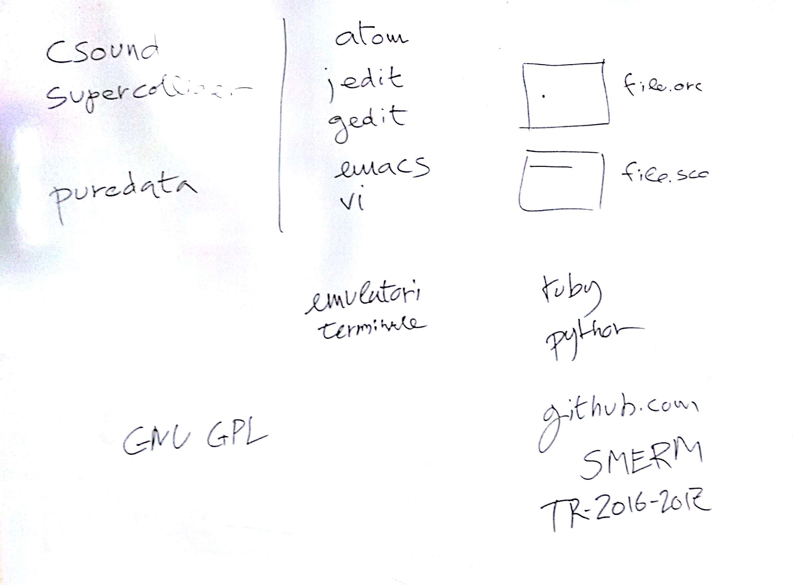

# Lezione di giovedì 1 dicembre 2016

## Argomenti

* definizione degli strumenti d'uso nel corso:

  * elenco funzionale di software musicale
    * *csound*, *supercollider*
    * *pure data*
    * *audacity*
    * *ardour*
  * strumenti ausiliari:
    * editor di testo (*atom*, *jedit*, *gedit*, *emacs*, *vi*, ecc.)
  * linguaggi di programmazione:
    * *python*,
    * *ruby*,
    * ecc.
  * Softare Libero e licenze libere
