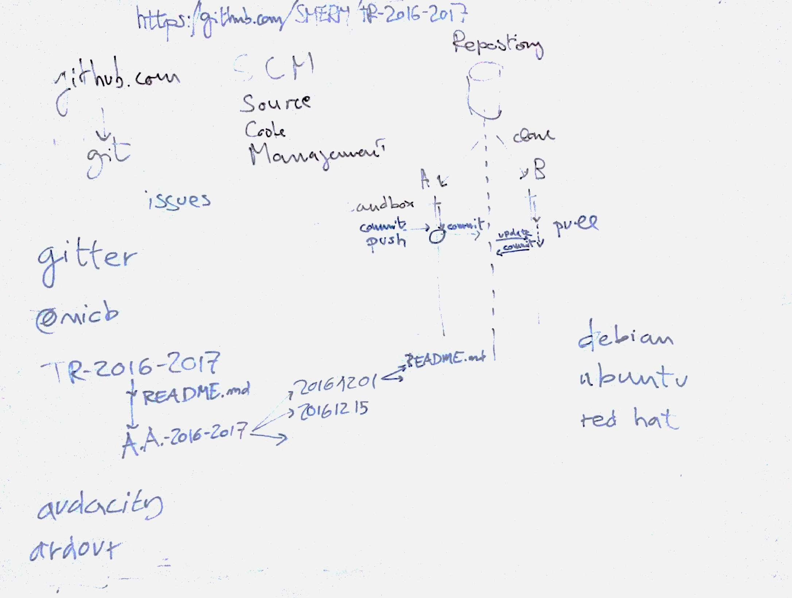

# Lezione di giovedì 15 dicembre 2016

## Argomenti

* discussione della domanda: *Ma quindi si sta facendo esperienza dell'arte solo quando a seguito di una
  reazione estatica dell'immaginazione (necessaria?) si ha il "coraggio" di
  non essere recettori passivi e anzi si adotta quell'evento come strumento
  di indagine che produce un qualche tipo di sforzo creativo?*
* descrizione del funzionamento di *github.com* 
