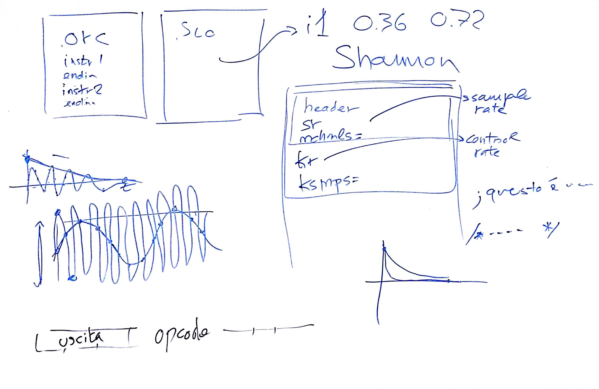

# Lezione di venerdì 20 gennaio 2017

## Argomenti

* introduzione a `csound`:
  * descrizione del `header`
  * il concetto di *control rate*
  * primi programmi, compilati

## Compiti per casa

* realizzare una scala diatonica ascendente con suoni glissati *staccato* esponenzialmente di una seconda maggiore ascendente
* scegliere collettivamente e democraticamente un linguaggio di programmazione tra `python` e `ruby`
