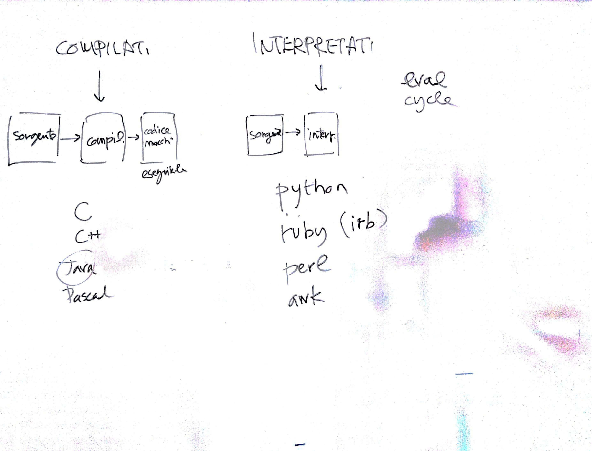
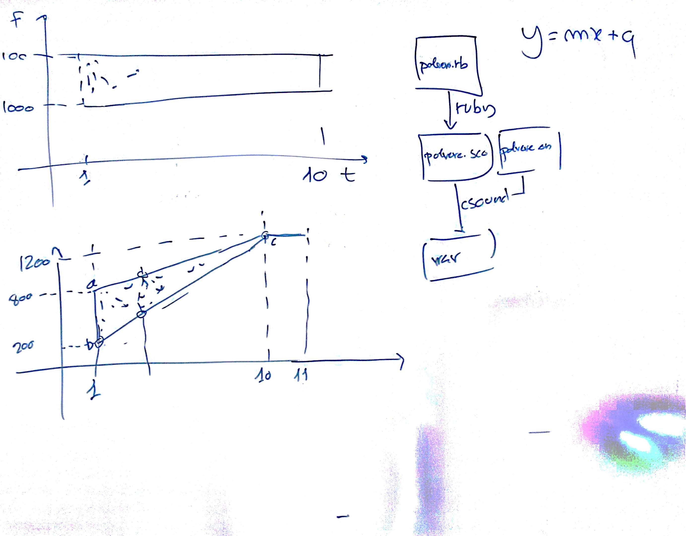

# Lezione di giovedì 26 gennaio 2017

## Argomenti

* revisione dei compiti per casa
* sommario dei linguaggi di programmazione:
  * linguaggi compilati
  * linguaggi interpretati
* scelta del linguaggio:
  * `python` o `ruby`? `ruby`
* realizzazione di una fascia di pulviscolo sonoro

## Compiti per casa

* realizzazione di una fascia ascendente di pulviscolo sonoro
