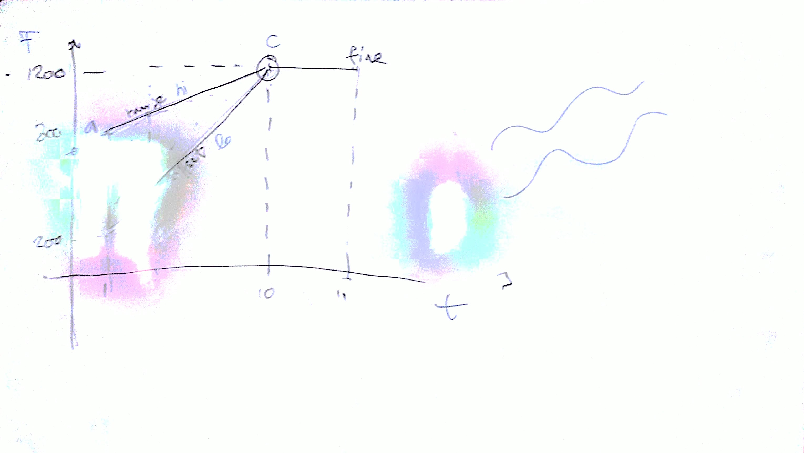

# Lezione di giovedì 2 febbraio 2017



## Argomenti

* revisione dei compiti per casa (vedi [1])
* linguaggi strutturati
* strutture dati
* linguaggi orientati agli oggetti (*object-oriented*)
* ristrutturazione del compito secondo il paradigma dell'orientamento all'oggetto (vedi [2])

## Codice

[1] `pp.rb`:

```ruby
ngrani= 1000                  #le costanti iniziano con la lettera  maiuscola
inizio=1
fine=11

a=[inizio,800]                     #dichiarazione di array
b=[inizio,200]                    
c=[10,1200]

mhi= (c[1]-a[1])/(c[0]-a[0])       #coeff. angolare retta alta ac
qhi= a[1]-mhi*a[0]                 #indicizzazione di array 
mlo= (c[1]-b[1])/(c[0]-b[0])
qlo= b[1]-mlo*b[0]

print ("f1 0 4096 10 1\n")                     

1. upto(ngrani) do          
	at=rand()*(c[0]-a[0])+inizio 
	dur=rand()*1+0.1
	hi=mhi*at+qhi
	lo=mlo*at+qlo
	rangefreq=hi-lo                       
	freq=rand()*rangefreq+lo
	print "i1 %3.1f %10.6f %11.0f\n" % [at,dur,freq]
end

1. upto(ngrani/9) do
  at=rand()*1+10
  freq=1200
  dur=rand()*0.9+0.01
  print " i1 %3.1f %10.6f %11.0f\n" % [at,dur,freq]
end
```

[2] `polvere.rb` (*object-oriented*, da completare a casa):

```ruby
class Coordinata

	attr_reader :x,:y
	
	def initialize(x,y)
		@x=x
		@y=y
	end
	
end

class Retta 

	def initialize (i,f)
		@inizio=i
		@fine=f
  end
		
end

#
# COMPITO: completare questo file con tutte le classi necessarie
#
```

## Compiti per casa

* completamento delle classi necessarie alla ristrutturazione del programma
