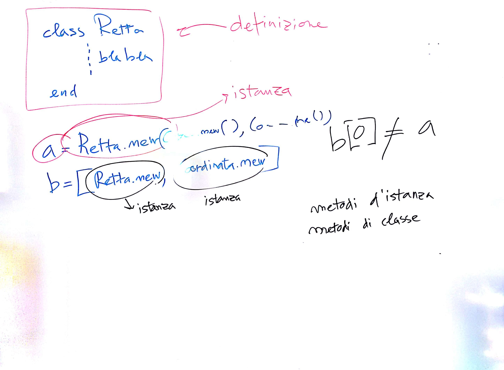
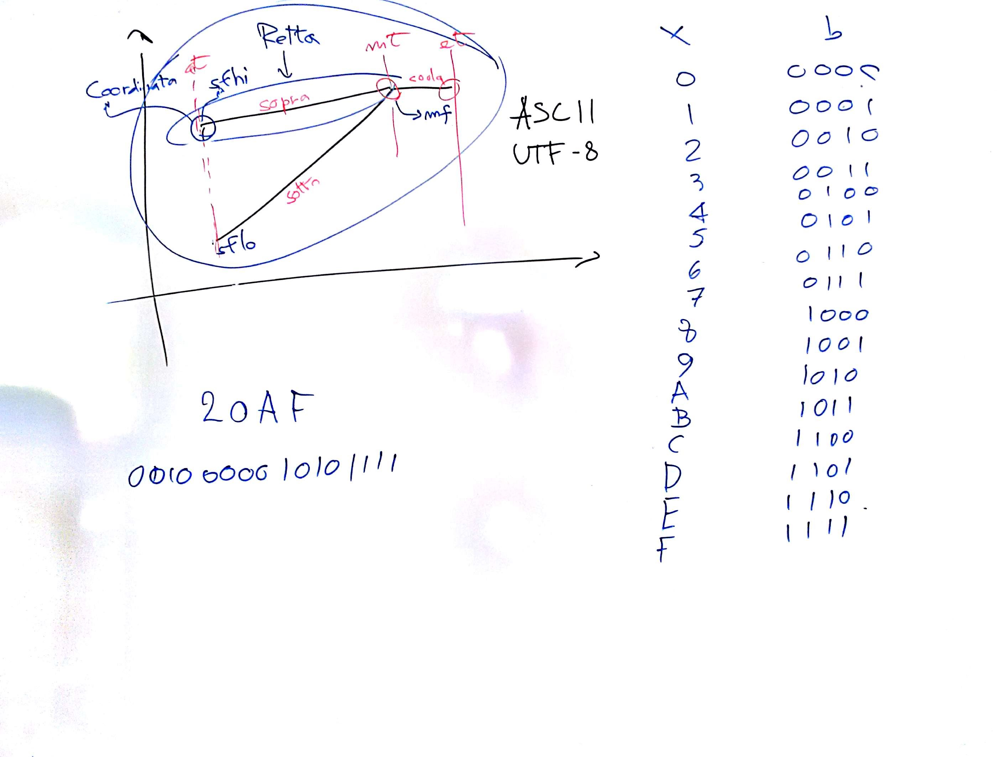

# Lezione di giovedì 16 febbraio 2017




## Argomenti

* revisione dei compiti per casa
* linguaggi orientati agli oggetti:
  * *classi*
  * *istanze*
  * *variabili d'istanza*
  * *metodi d'istanza*
  * *metodi di classe*

## Codice

* `pulviscolo.rb`:

```ruby
class Coordinata 
  
	attr_accessor :x,:y 

	def initialize(x=0.0,y=0.0) 
		@x=x
		@y=y
	end
		
end 

class Retta 
	   
	attr_reader :inizio,:fine

	def initialize (i,f)
	  @inizio=i
	  @fine=f
	end

end

#Documentazione
	   
class Processo 
	   
  attr_reader :sotto,:sopra,:coda

  def initialize (at,mt,et,sflo,sfhi,mf) 
    @sotto=Retta.new(Coordinata.new(at,sflo),Coordinata.new(mt,mf))
    @sopra=Retta.new(Coordinata.new(at,sfhi),Coordinata.new(mt,mf))
		@coda=Retta.new(Coordinata.new(mt,mf),Coordinata.new(et,mf))
  end

end
```

## Compiti per casa

* completamento delle classi necessarie alla ristrutturazione del programma
