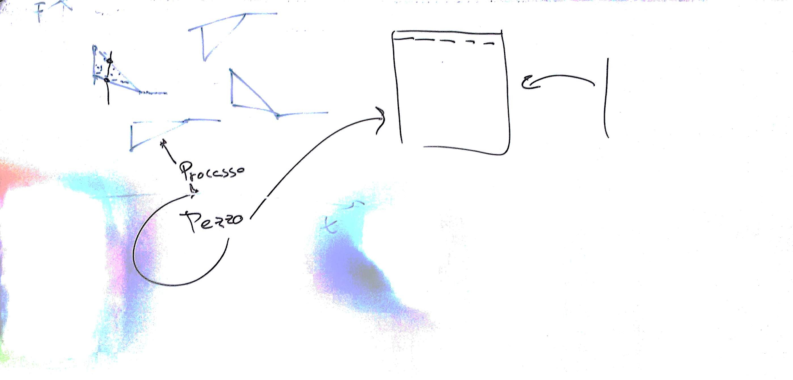

# Lezione di giovedì 3 marzo 2017



## Argomenti

* revisione dei compiti per casa
* realizzazione delle classi:
  * `Retta` (metodi)
  * `Evento`
  * `Processo`

## Codice

* `pulviscolo.rb`:

```ruby
class Coordinata 
  
        attr_accessor :x,:y 
        def initialize(x=0.0,y=0.0) 
            @x=x
            @y=y
        end
        
end 

# classe Retta
# - inizio: è la Coordinata di inizio 
# - fine: è la Coordinata di fine

class Retta 
       
       attr_reader :inizio,:fine
       def initialize (i,f)
           @inizio=i
           @fine=f   
       end
       
       def coefficiente_angolare 
           (self.fine.y-self.inizio.y)/(self.fine.x-self.inizio.x)         
       end
     
       def offset
           self.inizio.y-self.inizio.x*self.coefficiente_angolare
       end   
       
       def y(x)
           self.coefficiente_angolare*x+self.offset
       end
end

class Evento
      
      attr_reader :at,:dur,:freq,:amp,:instr
      def initialize(at,freq,dur=0.1,amp=-18.0,instr=1)
        @at=at
        @freq=freq
        @dur=dur
        @amp=amp
        @instr=instr
      end 
      
      def to_csound 
        "i%02d %8.4f %8.4f %+6.2f %8.4f" % [self.instr,self.at,self.dur,self.amp,self.freq]     
      end 
end
  
# classe Processo:
# elabora un elemento pulviscolare
# argomenti:
# - at: action time del Processo
# - mt: mid time del Processo 
# - et: end time del Processo
# - sflo: frequenza iniziale della retta inferiore
# - sfhi: frequenza iniziale della retta superiore
# - mf: frequenza della retta finale
# - ne: numero degli eventi

class Processo 
       
       attr_reader :sotto,:sopra,:coda,:eventi,:num_eventi 
       def initialize (at,mt,et,sflo,sfhi,mf,ne=100) 
           @sotto=Retta.new(Coordinata.new(at,sflo),Coordinata.new(mt,mf)) 
           @sopra=Retta.new(Coordinata.new(at,sfhi),Coordinata.new(mt,mf))
           @coda=Retta.new(Coordinata.new(mt,mf),Coordinata.new(et,mf))
           @num_eventi=ne
           crea 
       end
private
       def quando
         range=self.coda.fine.x-self.sopra.inizio.x
         rand()*range+self.sopra.inizio.x   
       end  
       def freq(q)
         if q>self.sopra.fine.x
           ris=self.coda.y(q)
         else 
           range=self.sopra.y(q)-self.sotto.y(q)
           ris=rand()*range+self.sotto.y(q)
         end
         return ris
       end
       def crea 
         @eventi=[]
         1.upto(self.num_eventi) do
           |n|
           at=quando
           f=freq(at)
           @eventi << Evento.new(at,f) 
         end
       end   
end
#
#class Pulviscolo 
#       def initialize ()
#           @
#           @
#       end
#end      
```

## Compiti per casa

* scrittura del metodo `to_csound` della classe `Processo`
