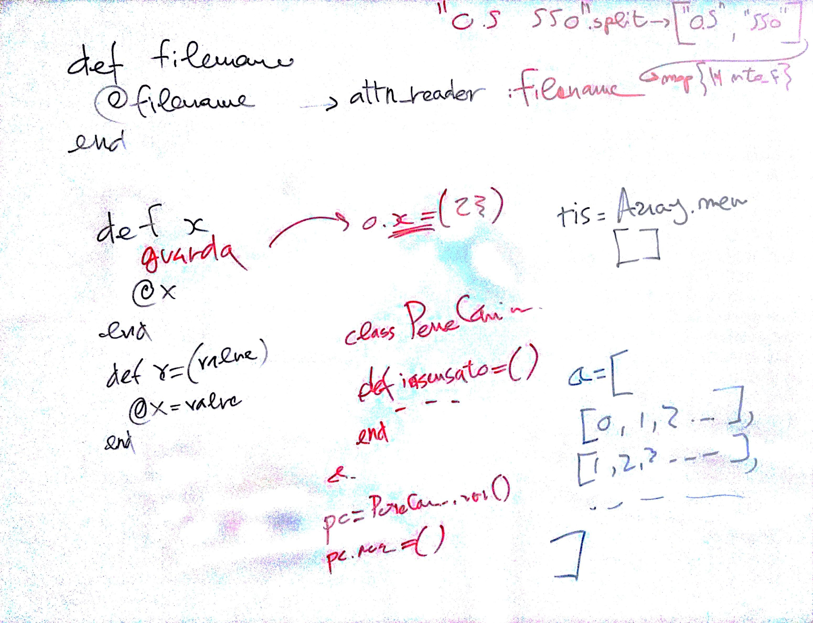

# Lezione di giovedì 23 marzo 2017

## Argomenti

* revisione dei compiti per casa
* rilettura completa del software `Pulviscolo`

## Compiti per casa

* Realizzazione individuale di un *proprio* pulviscolo, personale e identitario,
  utilizzando il software realizzato, un proprio file di metadati ed
  (eventualmente) altro software scritto personalmente. (seconda iterazione)
