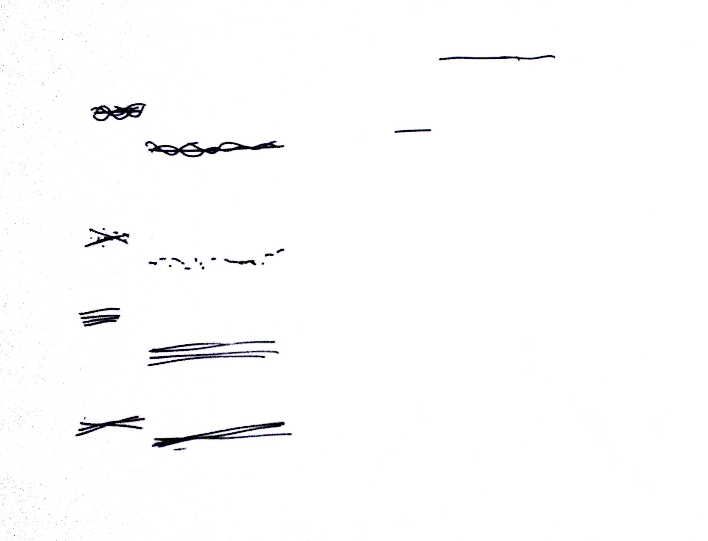

# Lezione del 03 luglio 2017

## Argomenti

* Esperimenti con le classi `Nota`, `Melodia` e derivati

## Compiti per casa

* Realizzazioni elettroacustiche di variazioni sul primo tema della Sinfonia
  n.4 di Johannes Brahms (alcuni esempi vengono rappresentati alla lavagna)
